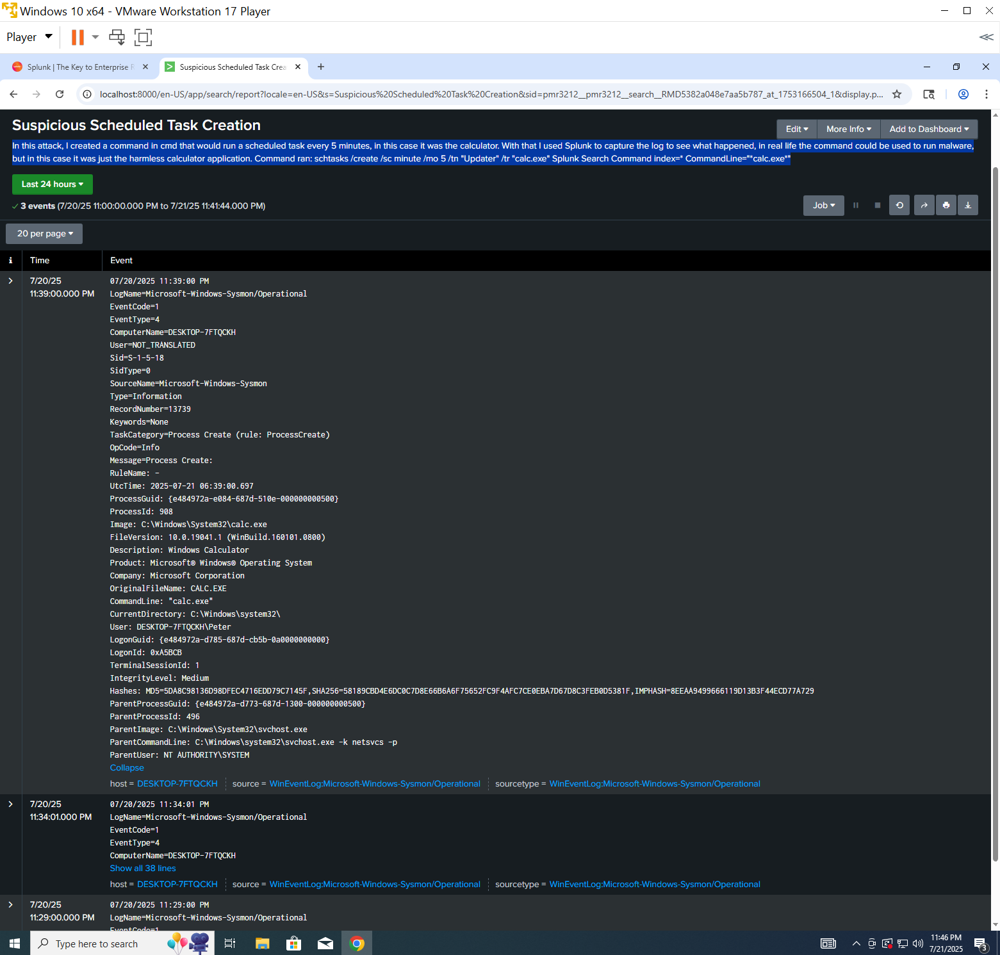

# Sysmon-Splunk-detection

This repo contains hands-on detection labs using Splunk, Sysmon, and Windows logging.

## Tools Used
- Sysmon (with config)
- Splunk
- Windows VM (via VMware)

## Attack 1 – Suspicious Scheduled Task Creation
**Command used**
```PowerShell
schtasks /create /sc minute /mo 5 /tn "Updater" /tr "calc.exe" 

**Detection Method in Splunk**
index=* CommandLine="*calc.exe*"


